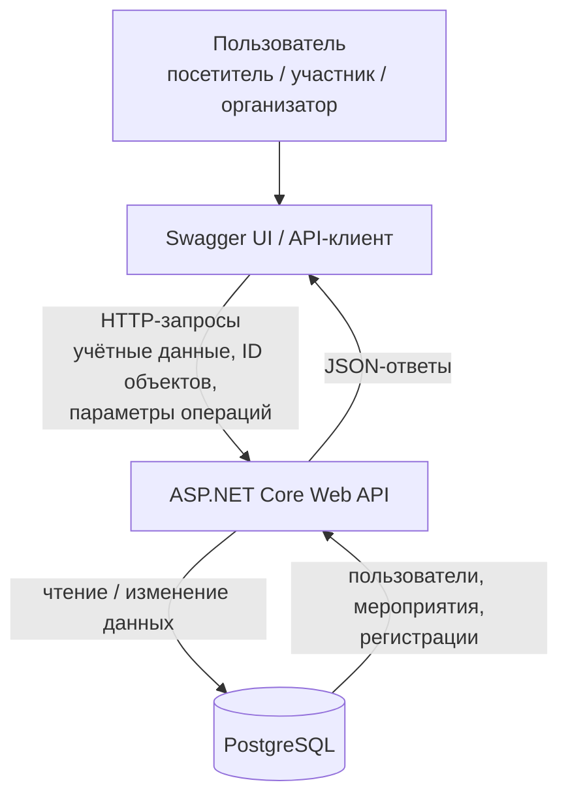

# Модель угроз — CampusPass

## 1. Архитектура

CampusPass использует простую клиент-серверную архитектуру.

### Компоненты

**Swagger UI / API-клиент** формирует запросы пользователя. Клиентская сторона не считается доверенной.

**ASP.NET Core Web API**:

- принимает HTTP-запросы;
- аутентифицирует пользователя;
- проверяет входные данные и полномочия;
- применяет правила регистрации и управления мероприятиями;
- читает и изменяет данные через Entity Framework Core.

**PostgreSQL** хранит:

- пользователей;
- мероприятия;
- регистрации.

Доступ к базе данных выполняется через сервер приложения. Прямой доступ пользователя к базе в рассматриваемой архитектуре отсутствует.

### Точки входа

Основными точками входа являются HTTP-запросы к API для:

- просмотра опубликованных мероприятий;
- создания, изменения и публикации мероприятия;
- создания регистрации на мероприятие;
- отмены собственной регистрации;
- просмотра собственных регистраций;
- просмотра организатором списка участников своего мероприятия.

Точные URL на текущем этапе могут изменяться; для модели угроз существенны доступные операции и передаваемые в них данные.

## 2. Границы доверия

### TB-01. Клиент → сервер приложения

Основная граница доверия проходит между Swagger UI / API-клиентом и ASP.NET Core Web API.

Клиент считается недоверенной стороной. Сервер не должен считать допустимыми значения только потому, что они пришли от штатного интерфейса.

Через границу могут передаваться:

- учётные данные;
- идентификатор мероприятия;
- идентификатор регистрации;
- название и описание мероприятия;
- дата и время мероприятия;
- вместимость;
- команды создания, изменения, публикации, регистрации и отмены регистрации.

Недоверенным вводом являются в том числе идентификаторы существующих объектов. Знание корректного ID мероприятия или регистрации не означает наличие права просматривать или изменять этот объект.

Сервер самостоятельно определяет:

- какой пользователь выполняет действие;
- является ли пользователь автором мероприятия;
- принадлежит ли регистрация текущему пользователю;
- опубликовано ли мероприятие;
- имеются ли свободные места;
- существует ли уже активная регистрация пользователя;
- допустимо ли запрошенное изменение состояния.

## 3. Значимые свойства

Для модели угроз наиболее важны следующие свойства продукта:

- только автор мероприятия может изменять и публиковать его;
- список участников не должен раскрываться посторонним пользователям и организаторам чужих мероприятий;
- пользователь может отменять только собственную регистрацию;
- операции с регистрацией должны выполняться от имени фактически аутентифицированного пользователя;
- число активных регистраций не должно превышать вместимость мероприятия;
- один пользователь не должен иметь несколько активных регистраций на одно мероприятие;
- черновики мероприятий не должны быть доступны обычным посетителям и участникам.

## 4. Угрозы

### T-01. Изменение или публикация чужого мероприятия

**Субъект:** авторизованный организатор.

**Сценарий:** организатор получает или подбирает идентификатор мероприятия, созданного другим организатором, и напрямую отправляет запрос на его изменение или публикацию.

**Недоверенный вход:** идентификатор мероприятия и изменяемые поля мероприятия.

**Затронутый объект:** карточка мероприятия.

**Нарушаемое свойство:** только автор мероприятия может изменять и публиковать его.

**Последствия:** посторонний организатор может изменить описание, время, вместимость или состояние чужого мероприятия, что нарушает целостность данных и управление мероприятием.

**Связанное требование:** `SR-01`.

**Предварительный приоритет:** высокий.

**Обоснование:** идентификаторы объектов поступают от клиента, сценарий непосредственно затрагивает основной сценарий управления мероприятиями, а отсутствие серверной проверки авторства позволяет изменять чужие данные.

---

### T-02. Получение списка участников чужого мероприятия

**Субъект:** авторизованный пользователь или организатор другого мероприятия.

**Сценарий:** пользователь подставляет идентификатор чужого мероприятия в запрос списка участников и пытается получить сведения о зарегистрированных пользователях.

**Недоверенный вход:** идентификатор мероприятия.

**Затронутый объект:** список участников мероприятия.

**Нарушаемое свойство:** список участников доступен только организатору соответствующего мероприятия.

**Последствия:** раскрывается информация о составе участников и их связи с конкретным мероприятием.

**Связанное требование:** `SR-02`.

**Предварительный приоритет:** средний.

**Обоснование:** сценарий реалистичен при прямом обращении к API, однако не изменяет состояние системы. Основное последствие связано с конфиденциальностью данных.

---

### T-03. Отмена чужой регистрации

**Субъект:** авторизованный участник.

**Сценарий:** участник получает или подбирает идентификатор регистрации другого пользователя и отправляет запрос на её отмену.

**Недоверенный вход:** идентификатор регистрации.

**Затронутый объект:** регистрация другого участника.

**Нарушаемое свойство:** участник может отменять только собственную регистрацию.

**Последствия:** законный участник теряет место на мероприятии, а количество свободных мест изменяется без его действия.

**Связанное требование:** `SR-03`.

**Предварительный приоритет:** высокий.

**Обоснование:** операция отмены является основным сценарием продукта, идентификатор регистрации приходит от недоверенного клиента, а отсутствие проверки владельца непосредственно позволяет воздействовать на другого пользователя.

---

### T-04. Выполнение операции от имени другого пользователя

**Субъект:** авторизованный участник.

**Сценарий:** участник формирует запрос так, чтобы операция регистрации или отмены была выполнена от имени другого пользователя (например передаёт чужой идентификатор пользователя) через любой доступный параметр.

**Недоверенный вход:** параметры запроса, способные указывать пользователя, от имени которого выполняется операция.

**Затронутый объект:** регистрация участника.

**Нарушаемое свойство:** операции с регистрацией выполняются только от имени фактически аутентифицированного пользователя.

**Последствия:** могут появиться или измениться регистрации, которые другой пользователь не создавал и не отменял.

**Связанное требование:** `SR-04`.

**Предварительный приоритет:** высокий.

**Обоснование:** идентичность пользователя критична для основного сценария регистрации. Сервер должен определять действующего пользователя из доверенного контекста аутентификации, а не из изменяемых клиентом параметров.

---

### T-05. Превышение вместимости при конкурентной регистрации

**Субъект / условие:** два или более участника одновременно отправляют корректные запросы регистрации.

**Сценарий:** у мероприятия остаётся одно свободное место. Два запроса почти одновременно проверяют наличие места до фиксации регистрации. Оба получают результат «место доступно» и создают регистрации.

**Недоверенный вход:** сочетание нескольких одновременно выполняемых запросов.

**Затронутый объект:** регистрации и вместимость мероприятия.

**Нарушаемое свойство:** количество активных регистраций не должно превышать вместимость.

**Последствия:** мероприятие оказывается переполнено, а состояние системы перестаёт соответствовать установленной вместимости.

**Связанное требование:** `SR-05`.

**Предварительный приоритет:** высокий.

**Обоснование:** угроза возникает даже без подстановки чужого идентификатора и даже из нескольких по отдельности корректных запросов. Она относится к основному сценарию регистрации и нарушает согласованность состояния при конкурентном доступе.

---

### T-06. Повторная активная регистрация одного пользователя

**Субъект:** авторизованный участник.

**Сценарий:** уже зарегистрированный участник повторно отправляет запрос регистрации на то же мероприятие, в том числе несколько запросов подряд или одновременно.

**Недоверенный вход:** повторные запросы регистрации на одно мероприятие.

**Затронутый объект:** регистрации пользователя и количество занятых мест.

**Нарушаемое свойство:** один пользователь не должен иметь более одной активной регистрации на одно мероприятие.

**Последствия:** один пользователь занимает несколько мест, количество свободных мест становится некорректным, а список участников содержит логические дубликаты.

**Связанное требование:** `SR-06`.

**Предварительный приоритет:** высокий.

**Обоснование:** повторный запрос легко сформировать напрямую через API. Нарушение влияет на вместимость и один из центральных бизнес-сценариев продукта.

---

### T-07. Просмотр или регистрация на неопубликованное мероприятие

**Субъект:** посетитель или авторизованный участник.

**Сценарий:** пользователь узнаёт или подбирает идентификатор мероприятия в состоянии `draft` и обращается к нему напрямую, минуя обычный список опубликованных мероприятий. Авторизованный участник также может попытаться зарегистрироваться на такой черновик.

**Недоверенный вход:** идентификатор мероприятия.

**Затронутый объект:** карточка мероприятия и регистрация.

**Нарушаемое свойство:** мероприятие в состоянии `draft` не должно быть доступно посетителям и участникам и не должно принимать регистрации.

**Последствия:** раскрываются неподтверждённые сведения о мероприятии, возникают регистрации на мероприятие, которое организатор ещё не опубликовал.

**Связанное требование:** `SR-07`.

**Предварительный приоритет:** средний.

**Обоснование:** отсутствие мероприятия в обычном списке не препятствует прямому запросу по известному ID. Поэтому сервер должен учитывать состояние объекта при принятии решения о просмотре и регистрации.

## 5. Связь угроз с требованиями

| Угроза | Нарушаемое требование |
| --- | --- |
| `T-01` | `SR-01` |
| `T-02` | `SR-02` |
| `T-03` | `SR-03` |
| `T-04` | `SR-04` |
| `T-05` | `SR-05` |
| `T-06` | `SR-06` |
| `T-07` | `SR-07` |

## 6. Предварительный приоритетный набор

На текущем этапе в приоритетный набор входят:

- `T-01` — изменение или публикация чужого мероприятия;
- `T-03` — отмена чужой регистрации;
- `T-04` — выполнение операции от имени другого пользователя;
- `T-05` — превышение вместимости при конкурентной регистрации;
- `T-06` — повторная активная регистрация одного пользователя.

Эти угрозы непосредственно затрагивают основные сценарии CampusPass и могут привести к несанкционированному изменению состояния системы либо нарушению согласованности регистраций.

`T-02` и `T-07` также релевантны продукту и должны учитываться, но предварительно имеют средний приоритет. `T-02` в первую очередь приводит к раскрытию данных без изменения состояния системы. `T-07` связан с доступом к ещё не опубликованным мероприятиям и регистрацией на них.

Приоритеты являются предварительными и могут быть уточнены к S04 после дополнительной проверки архитектуры и сценариев.
